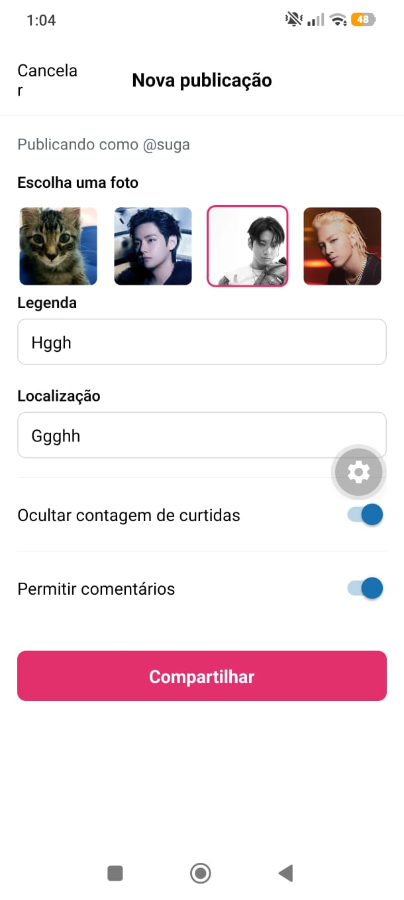

# Instagram (reimplementação) — React Native + Expo + TypeScript

Trabalho de reimplementação de um aplicativo real, com três telas conectadas por navegação, feito com React Native, Expo Router e TypeScript.

## 1. Aplicativo usado como referência

**Instagram** — rede social de compartilhamento de fotos. Foi reproduzido um fluxo coerente de "rede social": ver o feed, visitar o perfil de um usuário e criar uma nova publicação.

## 2. Telas escolhidas

| Tela | Descrição |
|---|---|
| **1. Feed** (`src/app/index.tsx`) | Lista de stories (rolagem horizontal) e lista de publicações (rolagem vertical), geradas a partir de dados mockados. |
| **2. Perfil** (`src/app/profile/[id].tsx`) | Cabeçalho do usuário (avatar, nome, bio, contadores de publicações/seguidores/seguindo) e grade (3 colunas) com as publicações daquele usuário. Recebe o `id` do usuário via parâmetro de navegação. |
| **3. Nova publicação** (`src/app/new-post.tsx`) | Formulário para "criar" uma publicação: escolher uma foto mockada, escrever legenda, localização e alternar duas opções (ocultar curtidas / permitir comentários). |

**Fluxo de navegação:** Feed → (toque no avatar/nome de um usuário) → Perfil → (botão " + ") → Nova publicação → volta ao Perfil após "publicar".

## 3. Instruções de execução

```bash
npm install
npx expo start
```

No terminal, escolha abrir no emulador Android/iOS, no Expo Go ou no navegador (`w`).

## 4. Funcionalidades implementadas

- Navegação entre as 3 telas com **Expo Router**, incluindo passagem de parâmetros (`id` do usuário do Feed para o Perfil; `userId` do Perfil para a tela de Nova publicação).
- Listagem de **stories** e **publicações** no Feed via `FlatList` com `keyExtractor`, a partir de dados mockados.
- Listagem em **grade** (3 colunas) das publicações de um usuário na tela de Perfil, também via `FlatList` (`numColumns={3}`).
- **Formulário controlado** na tela de Nova publicação, com:
  - seletor de imagem (lista horizontal de miniaturas, estado controlado);
  - campo de legenda (`TextInput` multiline, obrigatório, com validação e mensagem de erro);
  - campo de localização (`TextInput`, opcional);
  - dois `Switch` (ocultar contagem de curtidas / permitir comentários).
- **Feedback visual** ao publicar: o botão muda de texto/estado e um alerta de sucesso confirma a "publicação" (sem envio a servidor).
- App funciona **100% offline**, sem chamadas de rede.

## 5. Onde estão os dados mockados

- `src/data/users.ts` — usuários (avatar, nome, bio, contadores).
- `src/data/posts.ts` — publicações, cada uma associada a um `userId`.
- `src/data/stories.ts` — stories exibidos no topo do feed.
- `src/data/mock-images.ts` — galeria de imagens usada no seletor da tela "Nova publicação".

Os tipos desses dados estão em `src/model/user.ts` e `src/model/post.ts` (sem uso de `any`).

## 6. Componentização

| Componente | Onde é usado | Responsabilidade |
|---|---|---|
| `PostCard` | Feed | Renderiza uma publicação completa (cabeçalho, imagem, ações, legenda). |
| `StoryItem` | Feed | Renderiza um story individual (avatar + nome). |
| `ProfileHeader` | Perfil | Cabeçalho do perfil (avatar, contadores, bio, botão de ação). |
| `PostThumbnail` | Perfil | Miniatura de publicação usada na grade do perfil. |
| `FormField` | Nova publicação | Campo de formulário reutilizável (label + `TextInput` + erro). |
| `ImagePickerRow` | Nova publicação | Seletor horizontal de imagens mockadas com item selecionado. |

## 7. Screenshots




## 8. Fora do escopo (conforme enunciado)

Não há backend, banco de dados, autenticação real, integração com APIs externas ou persistência remota. Todos os dados são mockados localmente.
